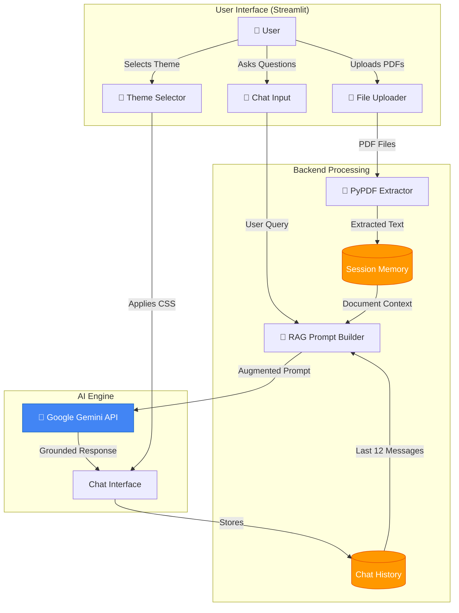
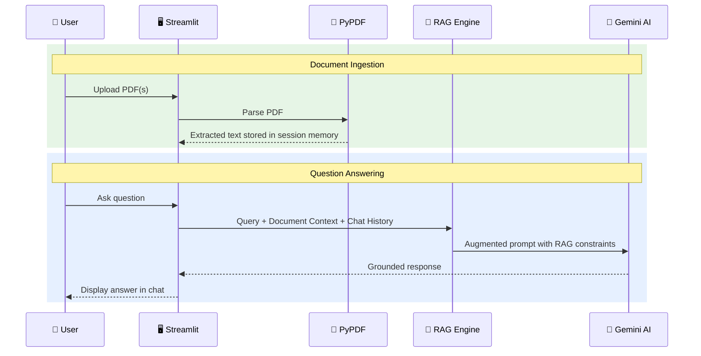

<p align="center">
  
  
  
  
  
</p>

<h1 align="center">📚 Document Q&A System</h1>
<h3 align="center"><em>Generative AI Powered Multi-Document Conversational Assistant</em></h3>

<p align="center">
  Upload PDFs · Extract Knowledge · Ask Questions · Get Grounded Answers
</p>

---

## 🌟 Overview

The **Document Q&A System** is an AI-powered web application that lets users upload PDF documents and have natural, multi-turn conversations about their content. Built on **Retrieval-Augmented Generation (RAG)** using **Google Gemini AI**, it ensures all answers are strictly grounded in the uploaded documents — no hallucinations.

> Developed for the **IBM Internship Program** under the **Generative AI Domain**.

---

## 🏗️ System Architecture



---

## ⚙️ RAG Pipeline — How It Works



The prompt sent to Gemini includes **5 strict RAG constraints**:
1. Answer **only** from the document content — no external knowledge
2. Never hallucinate or assume unmentioned facts
3. Clearly state when an answer cannot be found in the documents
4. Use conversation history to resolve follow-ups and pronouns
5. Keep responses factual, structured, and professional

---

## ✨ Key Features

| Feature | Description |
|---------|-------------|
| 📄 **Multi-Document Memory** | Upload multiple PDFs — all indexed and queryable in one session |
| 🔒 **Strict RAG Grounding** | Answers come only from document content, with hallucination safeguards |
| 💬 **Multi-Turn Conversations** | Chat history (last 12 messages) provides context for follow-up questions |
| 🎯 **Query Scope Control** | Choose to query all documents or a specific one |
| 🔐 **Secure API Key Handling** | `.env` support with password-masked fallback — key never exposed in UI |
| 🎨 **4 Visual Themes** | Cyber Obsidian (dark), Emerald Mint, Arctic Teal, Warm Sunset |
| 🔍 **Document Inspector** | Preview extracted text from uploaded PDFs before querying |

---

## 🎨 Available Themes

| Theme | Description |
|-------|-------------|
| 🌌 **Cyber Obsidian** | Pure black background with neon cyan & green accents — ideal for dark mode |
| 🌿 **Emerald Mint Luxe** | Light mint green with emerald accents — clean and professional (default) |
| ❄️ **Arctic Teal & Frost** | Icy blue-white with teal gradients — crisp corporate feel |
| 🌅 **Warm Sunset & Amber** | Warm cream with orange/amber accents — comfortable for long reading |

---

## 🛠️ Tech Stack

| Technology | Purpose |
|-----------|---------|
| [Streamlit](https://streamlit.io/) | Web UI with built-in chat components |
| [Google Gemini API](https://ai.google.dev/) | LLM for generating context-grounded answers |
| [PyPDF](https://pypdf.readthedocs.io/) | Lightweight PDF text extraction |
| [python-dotenv](https://pypi.org/project/python-dotenv/) | Secure API key management via `.env` |
| Python 3.9+ | Core language with type hints |

---

## 🚀 Quick Start

### Prerequisites
- Python 3.9+ ([Download](https://www.python.org/downloads/))
- Google Gemini API Key ([Get free from Google AI Studio](https://aistudio.google.com/))

### Setup

```bash
# 1. Clone the repository
git clone https://github.com/Krati-orbit/Document-Q-A-system-.git
cd Document-Q-A-system-

# 2. Install dependencies
pip install -r requirements.txt

# 3. Configure API Key — create a .env file
echo GEMINI_API_KEY=your_api_key_here > .env

# 4. Launch the application
streamlit run app.py
```

Open `http://localhost:8501` in your browser.

> **💡 Tip:** You can also enter your API key directly in the app sidebar if you prefer not to use a `.env` file.

---

## 📖 Usage


1. **Upload** one or more PDF documents via the sidebar
2. **Select scope** — query all documents or a specific one
3. **Ask questions** in natural language in the chat input
4. **Get grounded answers** based strictly on your document content
5. **Follow up** — the AI remembers your conversation context

---

## 📁 Project Structure

```
Document-Q-A-system-/
├── .streamlit/
│   └── config.toml            # Streamlit server & theme config
├── app.py                     # Main application (675 lines)
├── requirements.txt           # Python dependencies
├── .env                       # API key storage (git-ignored)
├── .gitignore                 # Git ignore rules
└── README.md                  # Documentation
```

### `app.py` — Code Organization

| Section | Lines | Description |
|---------|-------|-------------|
| `THEMES` | 29–114 | 4 complete theme color configurations |
| `apply_custom_theme()` | 117–348 | Dynamic CSS injection engine |
| `extract_text_from_pdf()` | 359–397 | PyPDF text extraction with error handling |
| `generate_rag_response()` | 400–472 | RAG prompt construction + Gemini API call |
| `main()` | 479–674 | Streamlit UI rendering, sidebar, chat logic |

---

## 🔐 Security

- API keys loaded from `.env` are **never displayed** in the UI
- Manual key input uses **password-masked** fields
- `.env` is listed in `.gitignore` — never committed to version control
- Keys exist only in **Streamlit session state** (ephemeral, in-memory)

---

## 🔮 Future Scope

- 🔍 Vector embeddings for semantic search (improved retrieval accuracy)
- 📎 Multi-format support (DOCX, TXT, CSV)
- ☁️ Cloud deployment (Streamlit Cloud / Google Cloud Run)
- 📊 Document analytics dashboard

---

## 👤 Author

Developed by **Krati** for the **IBM Generative AI Internship Program**.

[](https://github.com/Krati-orbit/Document-Q-A-system-)

---

<p align="center">
  <strong>⭐ Star this repo if you found it useful!</strong>
</p>
