<p align="center">
  
  
  
  
  
</p>

<h1 align="center">📚 Document Q&A System 🤖</h1>
<h3 align="center"><em>Generative AI Powered Multi-Document Conversational Assistant</em></h3>

<p align="center">
  <strong>Upload PDFs → Extract Knowledge → Ask Questions → Get Grounded Answers</strong>
</p>

<p align="center">
  Developed for the <strong>IBM Internship Program</strong> under the <strong>Generative AI Domain</strong>
</p>

---

## 📸 Application Preview

<p align="center">
  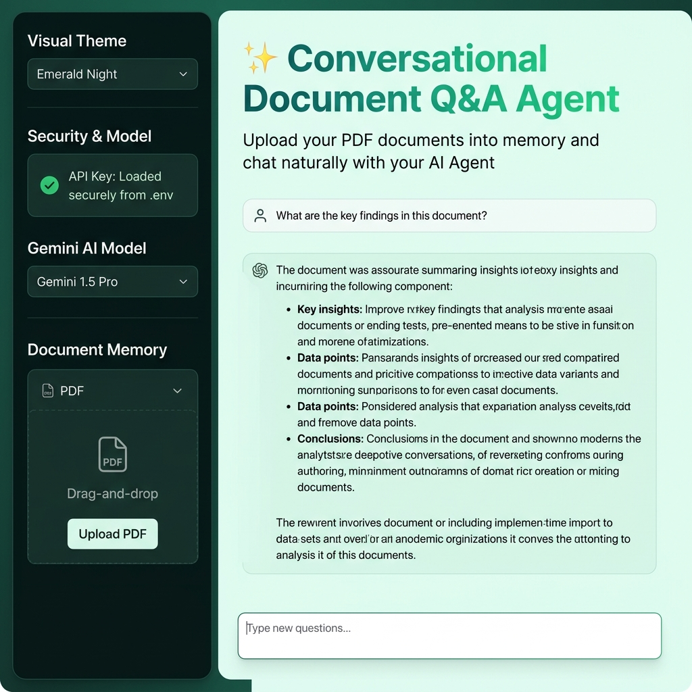
</p>

<p align="center"><em>Main chat interface with document upload sidebar and AI-powered Q&A</em></p>

---

## 🌟 Overview

The **Document Q&A System** is an intelligent, interactive web application that enables users to upload PDF documents and have natural, multi-turn conversations about their content. Built on **Retrieval-Augmented Generation (RAG)** principles using **Google Gemini AI**, the system provides accurate, context-grounded answers while preventing hallucinations.

### Why This Project?

| Problem | Solution |
|---------|----------|
| Reading long PDFs is time-consuming | Upload & ask questions in natural language |
| Traditional search returns keywords, not answers | AI generates human-readable, contextual answers |
| AI models can hallucinate facts | Strict RAG grounding ensures answers come **only** from your documents |
| Single-turn Q&A loses conversation context | Multi-turn memory recalls previous questions & answers |
| Generic AI interfaces look outdated | 4 premium, customizable visual themes |

---

## 🎓 IBM Internship Context

| Detail | Description |
|--------|-------------|
| **Domain** | Generative AI |
| **Project Type** | Internship / Capstone Project |
| **Objective** | Build a robust, scalable RAG-based conversational AI system for PDF document analysis |
| **Key Skills** | LLM Integration, RAG Architecture, Prompt Engineering, Python, Streamlit |

---

## 🏗️ System Architecture

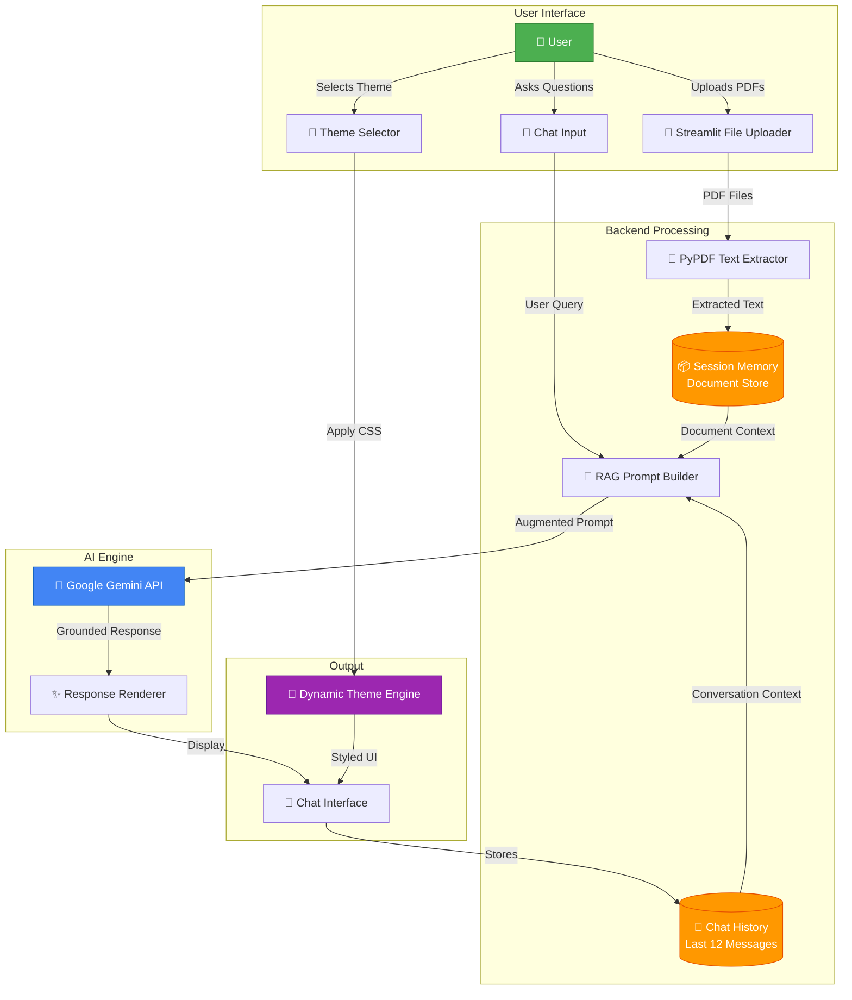

---

## ⚙️ How It Works — RAG Pipeline

The system follows a **Retrieval-Augmented Generation (RAG)** workflow to ensure all answers are grounded in the actual document content:

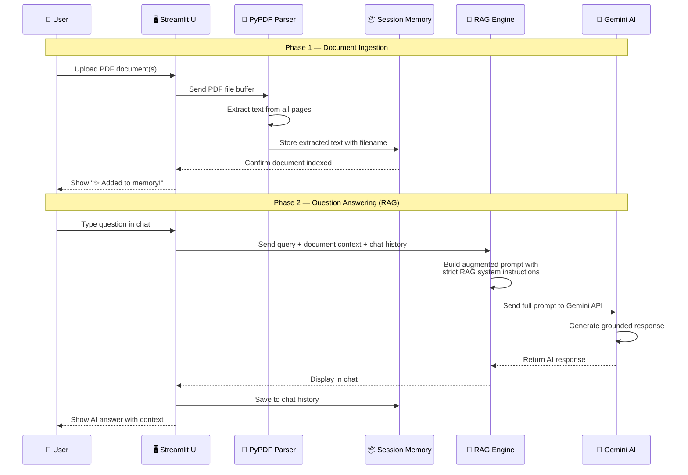

### RAG Prompt Construction Detail

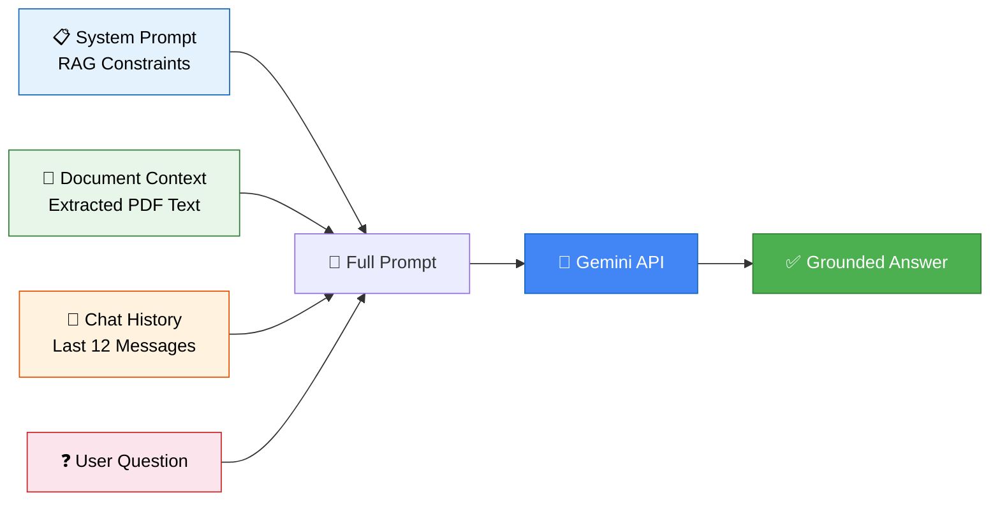

The RAG system prompt enforces **5 strict constraints**:
1. ✅ Answer **ONLY** using facts from the Document Context
2. 🚫 **NO** external knowledge or assumptions
3. 📢 Clearly state when an answer **cannot be found**
4. 🔄 Use conversation history for **follow-up context** (pronouns, references)
5. 📐 Keep answers **factual, structured, and professional**

---

## ✨ Key Features

### Core Capabilities

| Feature | Description | Implementation |
|---------|-------------|----------------|
| 📄 **Multi-Document Memory** | Upload and index multiple PDFs simultaneously | `st.session_state.documents` dictionary |
| 🔒 **Strict RAG Grounding** | Answers based only on document content | Custom system prompt with 5 constraints |
| 💬 **Multi-Turn Chat** | Maintains conversation history for context | Last 12 messages included in prompt |
| 🎯 **Query Scope Control** | Query all documents or a specific one | Dropdown selector in sidebar |
| 🔍 **Document Inspector** | Preview extracted text from uploaded PDFs | Expandable text area |
| 🗑️ **Document Management** | Remove individual documents or clear all | Per-document delete buttons |

### Security & Configuration

| Feature | Description |
|---------|-------------|
| 🔐 **Secure API Key** | Supports `.env` file — key never exposed in UI |
| ⌨️ **Manual Key Fallback** | Password-masked input if `.env` not configured |
| 🤖 **Model Selection** | Choose between Gemini Flash, Pro, and latest models |

### UI & Design

| Feature | Description |
|---------|-------------|
| 🎨 **4 Premium Themes** | Cyber Obsidian, Emerald Mint, Arctic Teal, Warm Sunset |
| ✏️ **Google Fonts** | Plus Jakarta Sans for modern typography |
| 🌊 **Dynamic Gradients** | Header and button gradient animations |
| 💫 **Micro-Animations** | Hover effects, button transforms, toast notifications |

---

## 🎨 Theme Gallery

The application features **4 distinct, hand-crafted visual themes** that can be switched instantly:

<p align="center">
  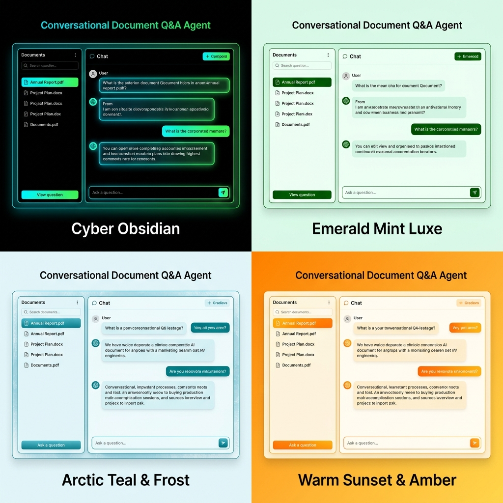
</p>

| Theme | Style | Best For |
|-------|-------|----------|
| 🌌 **Cyber Obsidian** | Pure black + neon cyan/green accents | Dark mode enthusiasts, night usage |
| 🌿 **Emerald Mint Luxe** | Light mint green + emerald accents | Default, professional presentations |
| ❄️ **Arctic Teal & Frost** | Icy blue-white + teal gradients | Clean, corporate environments |
| 🌅 **Warm Sunset & Amber** | Warm cream + orange/amber accents | Comfortable, extended reading sessions |

---

## 📂 Document Management

<p align="center">
  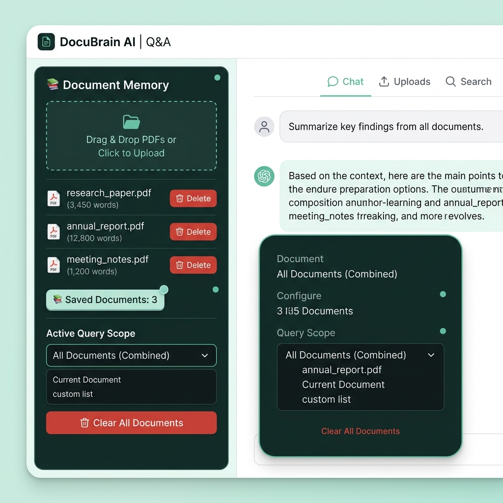
</p>

<p align="center"><em>Sidebar showing uploaded documents with word counts, delete options, and query scope selection</em></p>

---

## 🛠️ Tech Stack

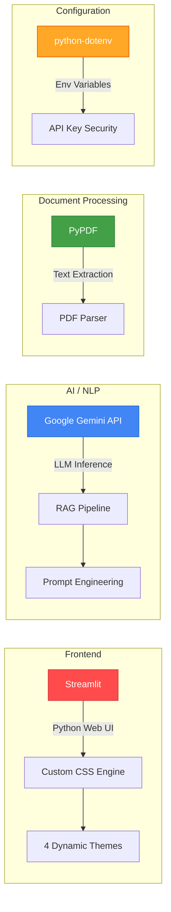

| Technology | Purpose | Why Chosen |
|-----------|---------|------------|
| **[Streamlit](https://streamlit.io/)** | Web UI Framework | Rapid Python web app prototyping with built-in chat components |
| **[Google Gemini API](https://ai.google.dev/)** | LLM Engine | State-of-the-art generative AI with excellent context handling |
| **[PyPDF](https://pypdf.readthedocs.io/)** | PDF Processing | Lightweight, pure-Python PDF text extraction |
| **[python-dotenv](https://pypi.org/project/python-dotenv/)** | Environment Config | Secure API key management via `.env` files |
| **Python 3.9+** | Language | Modern Python features with type hints |

---

## 🚀 Quick Start Guide

### Prerequisites

- ✅ **Python 3.9+** installed ([Download](https://www.python.org/downloads/))
- ✅ **Google Gemini API Key** ([Get one free from Google AI Studio](https://aistudio.google.com/))
- ✅ **pip** package manager (comes with Python)

### Step-by-Step Setup

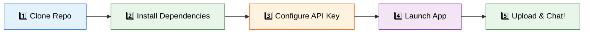

#### 1️⃣ Clone the Repository
```bash
git clone https://github.com/Krati-orbit/Document-Q-A-system-.git
cd Document-Q-A-system-
```

#### 2️⃣ Install Dependencies
```bash
pip install -r requirements.txt
```

This installs:
| Package | Version | Purpose |
|---------|---------|---------|
| `streamlit` | Latest | Web UI framework |
| `pypdf` | Latest | PDF text extraction |
| `google-generativeai` | Latest | Gemini API client |
| `python-dotenv` | Latest | Environment variable loader |

#### 3️⃣ Configure API Key

Create a `.env` file in the project root:
```env
GEMINI_API_KEY=your_actual_api_key_here
```

> **💡 Tip:** You can also enter your API key directly in the app sidebar if you prefer not to use a `.env` file. The input field is password-masked for security.

#### 4️⃣ Launch the Application
```bash
streamlit run app.py
```

#### 5️⃣ Open & Use
Navigate to `http://localhost:8501` in your browser, then:
1. Upload one or more PDF documents via the sidebar
2. Wait for text extraction to complete
3. Type your question in the chat input
4. Get AI-powered, document-grounded answers!

---

## 📖 Usage Guide

### Workflow Overview

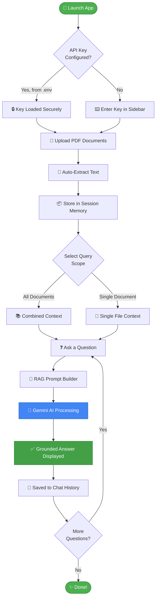

### Example Interactions

| You Ask... | AI Responds With... |
|------------|-------------------|
| *"Summarize the key findings"* | Structured summary extracted from document content |
| *"What does section 3 say about revenue?"* | Specific information from that section |
| *"Explain that in simpler terms"* | Simplified version using conversation context |
| *"Compare this with what was mentioned earlier"* | Cross-reference using chat history + document content |
| *"What is the capital of France?"* | *"I cannot find the answer to this question in the provided document(s)."* (RAG grounding!) |

---

## 📁 Repository Structure

```
📦 Document-Q-A-system-
├── 📂 .streamlit/
│   └── config.toml              # Streamlit UI & Server configuration
├── 📂 assets/
│   ├── main_interface.png       # App screenshot for README
│   ├── theme_showcase.png       # Theme gallery image
│   └── document_management.png  # Sidebar screenshot
├── 📄 app.py                    # Main application (675 lines)
│   ├── THEMES dict              # 4 complete theme configurations
│   ├── apply_custom_theme()     # Dynamic CSS injection engine
│   ├── extract_text_from_pdf()  # PyPDF text extraction
│   ├── generate_rag_response()  # RAG prompt builder + Gemini API call
│   └── main()                   # Streamlit UI rendering & logic
├── 📄 requirements.txt          # Python dependencies (4 packages)
├── 📄 .env                      # API Key storage (git-ignored)
├── 📄 .gitignore                # Git ignore rules
└── 📄 README.md                 # This documentation
```

### Code Architecture Breakdown

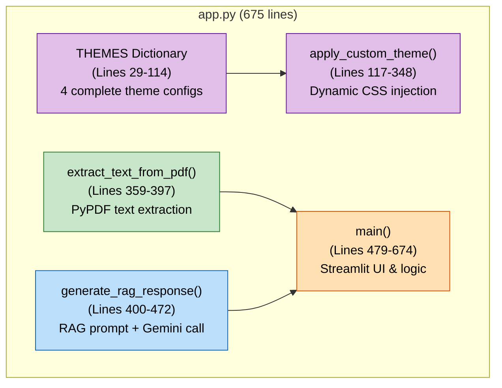

---

## 🔐 Security Design

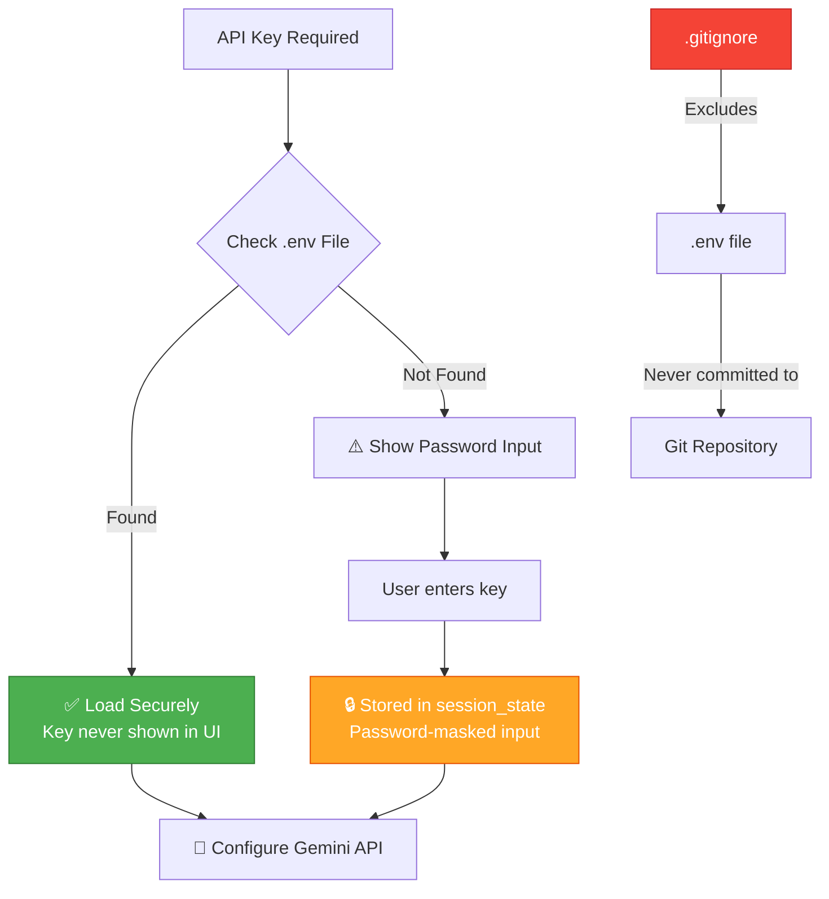

- 🔒 API keys loaded from `.env` are **never displayed** in the UI
- 🔐 Manual key input uses **password-masked** fields
- 📁 `.env` is in `.gitignore` — **never committed** to version control
- 🧠 Keys are stored only in **Streamlit session state** (ephemeral, in-memory)

---

## 🔮 Future Enhancements

| Enhancement | Description | Priority |
|-------------|-------------|----------|
| 📊 **Analytics Dashboard** | Document statistics, word clouds, topic modeling | Medium |
| 🔍 **Semantic Search** | Vector embeddings for better retrieval accuracy | High |
| 📎 **Multi-Format Support** | DOCX, TXT, CSV file support alongside PDF | Medium |
| ☁️ **Cloud Deployment** | Deploy on Streamlit Cloud or Google Cloud Run | High |
| 🧪 **Unit Tests** | Comprehensive test suite for all functions | Medium |
| 📱 **Mobile Optimization** | Responsive design for mobile devices | Low |

---

## 🤝 Contributing

1. Fork the repository
2. Create your feature branch (`git checkout -b feature/amazing-feature`)
3. Commit your changes (`git commit -m 'Add amazing feature'`)
4. Push to the branch (`git push origin feature/amazing-feature`)
5. Open a Pull Request

---

## 📜 License

This project was developed as part of the **IBM Generative AI Internship Program**.

---

## 👤 Author

<table>
  <tr>
    <td><strong>Developer</strong></td>
    <td>Krati</td>
  </tr>
  <tr>
    <td><strong>Program</strong></td>
    <td>IBM Generative AI Internship</td>
  </tr>
  <tr>
    <td><strong>Repository</strong></td>
    <td><a href="https://github.com/Krati-orbit/Document-Q-A-system-">GitHub</a></td>
  </tr>
</table>

---

<p align="center">
  <strong>⭐ If you found this project useful, please consider giving it a star! ⭐</strong>
</p>

<p align="center">
  
  
</p>
